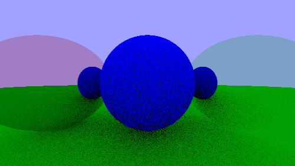
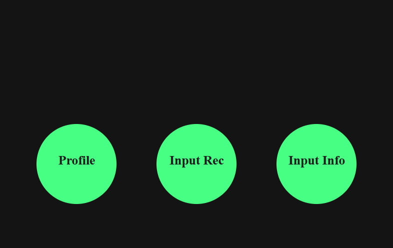
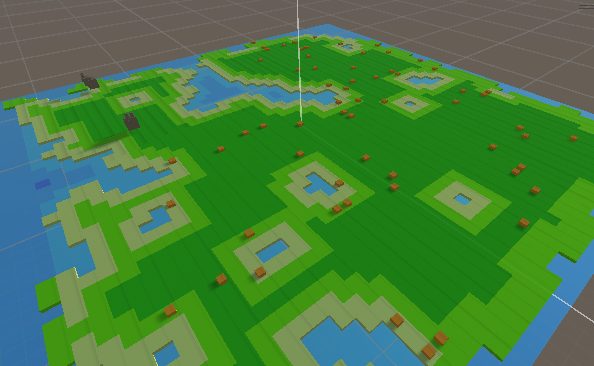
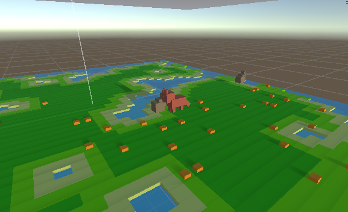
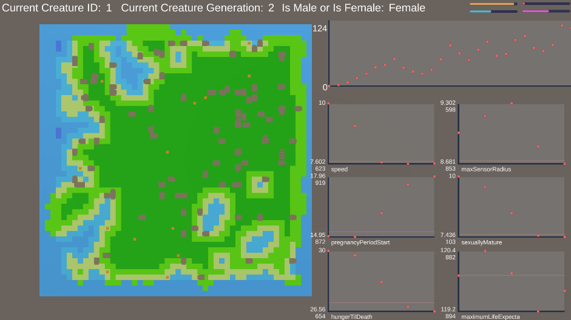

<h1 align="center">Hello! I'm Luke</h1>

<!-- Who Am I -->

  

    <h2 align = "center"> Who Am I? </h2>
  

  I am a 4th year BSc | Computer Science Honours student at the University of Victoria!
    
  Outside of school, I work primarily as an engineering and computer science educator for all ages:  
  <ul>
  <item><b>- Youth:</b> I have been professionally teaching youth concepts in engineering and computer science for <b>2+</b> years as of the end of 2024. I aim to engage youth creativity and intuition through engineering and computer science. Every week, every year, I aim to inspire and expand their knowledge of everything that is around them.  </item>
  
  <item><b>- University:</b> I am a teaching assistant for the University of Victoria; teaching and developing students to code at a professional level.</item>
  </ul>
  Outside of school and work, I enjoy cooking, playing board games, and playing volleyball.

<!-- What Am I Currently Working On -->

  

    <h2 align = "center"> What am I currently working on: Highlight </h2>
  

    

      You can find the teaser here! 
    

    
    

      I am working on a web application that allows teachers and professors to teach coding and computer science, especially to youth, more proficiently and accessible. I plan to create structure and ease for teachers and students in applications that weren't unavailable. The prototype is set to be live on February 3rd, however, for academic integrity, files are not public until that timeframe!
    

  

  <!-- Projects -->
  

    

      <h2 align = "center"> Projects and Portfolio! </h2>
    

    

      

        <h2 align = "center"> RayTracing Engine </h2>
      

      

        
      

      

        Created a ray tracing engine using C++ in a Linux environment with the ability to render images with light interactions on objects. Fully renders images into a ppm format, with customizable features for ease of use.
          
        Find out more about it <a href="[https://github.com/LukeIsLak/Generation-Simulator](https://github.com/LukeIsLak/Raytracing-Engine)">here!</a>
      

    

    

      

        <h2 align="center"> Spotify API Website </h2>
      

      

        
      

      

        Created a website in HTML, CSS, and JavaScript to show a Spotify user's information using JSON and OAuth2.0. In addition to retrieving user information, it also provides recommendations based on inputted songs or the user's current song preferences.
          
        While this project has been archived due to the change in the Spotify API, you can find the most recent production <a href="http://webhome.csc.uvic.ca/~lukekuligowicz/project2.html">here!</a>
      

    

    

      

        <h2 align="center"> Generational Simulator
      

      

        
        
        
      

      

        A C# based generation simulator built in the Unity Game Engine. Simulates how characteristics and traits are affected by environmental conditions over some time.
          
        Find out more about it <a href="https://github.com/LukeIsLak/Generation-Simulator">here!</a>
      

    

  

